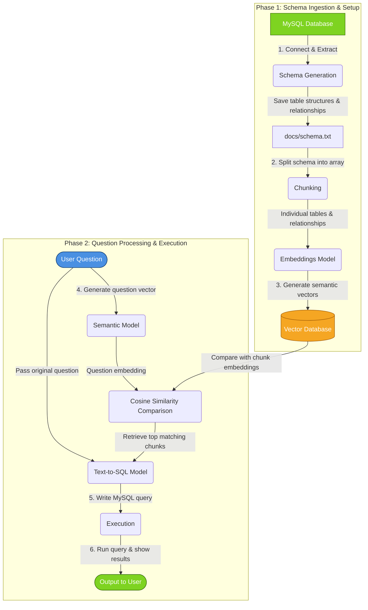

**What is this project?**
- Give this chatbot access to a mysql database and it will answer all the questions related to the db.

-----------

**How to run it?**
- Go to env file and add your mysql db credentials, qdrant crdentials (vector db), llm api key (openrouter)
    - You can use an online mysql database(freesqldatabase.com).
    - in docs/structure-data.sql you will find the sql queries to add in sample data in the db.
- Run .\venv\Scripts\Activate.ps1    to start venv
- run the main.py file
- you enter "generate schema" to generate a new schema.
- go ahead and ask your questions

-------------

**How does it work?**
- Schema Generation: When u ask it to generate a schema, a python script connects to the mysql database and generates a schema (table and relationship betweeen the tables) and stores it in a text file (docs/schema.txt)
- Chunking : This schema is then broken down and an array is created where every table is an element and relationship is an element. So the entire schema is broken down into individual tables where every table is an independent chunk. relationship is put into a seperate chunk.
- Embeddings : Every chunk is then sent to semantic model, to generate embedding for the chunk. All the embeddings are stored in a vector database. 
- Cosine similarity : User asks question, this question too sent to the semantic model to generate a embedding. This question converted embedding is then compared to the chunks embedding using cosine similarity alogithm to find out the top matching chunks.
- text to sql model : The top matching chunks and user question is sent to the text to sql model, with a prompt asking it to generate a mysql query. 
- Exeecution : The generated mysql is run and the output is shown to the user. 

----------

**flowchart**

-----------------